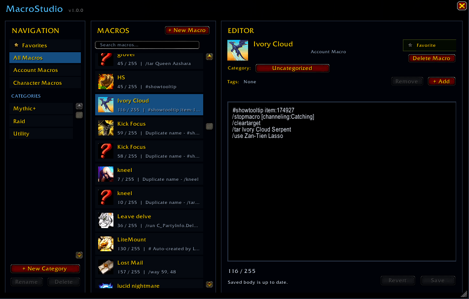
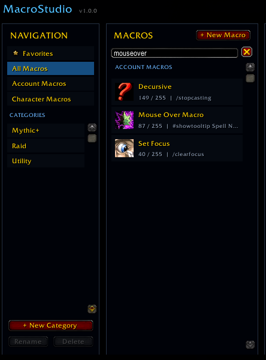
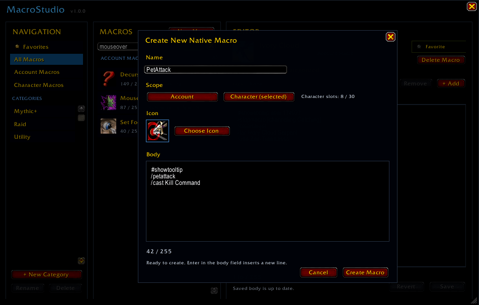

# MacroStudio

**A bigger, searchable, organized macro editor for World of Warcraft.**

Blizzard's macro window is tiny. MacroStudio gives you more room to edit, search, and organize your native WoW macros without changing how they work.

*Your Account and Character macros, all in one place.*

## Features

- **Big searchable editor:** Work comfortably in a resizable multiline editor and search names, bodies, categories, and tags.
- **Account + Character macros:** Browse and manage both scopes in one window.
- **Categories, tags, and Favorites:** Keep a large macro collection easy to navigate.
- **Edit name, icon, and body:** Update every part of an existing native macro together.
- **Create and delete macros:** Manage native WoW macros without returning to Blizzard's small editor.
- **Action-bar workflow:** Drag saved macros onto action bars and see which macros are currently **On Bar**.
- **Cross-character library:** Browse read-only snapshots from your other characters and copy a macro to your current character.
- **Flexible slash commands:** Optionally use MacroStudio for `/m` and `/macro`, with `/ms blizzard` always available for Blizzard's original window.
- **Quick launchers:** Open MacroStudio from its minimap button or WoW's AddOn Compartment.
- **Persistent Settings:** Control slash-command takeover and minimap visibility from one compact panel.
- **Combat-safe editing:** Drafts stay intact while protected macro changes remain blocked in combat.

## Find Macros Fast

*Find a macro instantly, even by text inside the macro body.*

## Create Macros

*Create Account or Character macros without opening Blizzard's macro window.*

## Coming Soon!

- Import and export your MacroStudio setup.
- Roll back mistakes with macro backups and history.
- Catch common macro problems with linting tools.

Want the full plan? See the [roadmap](ROADMAP.md).

## Usage

Open MacroStudio with `/ms` or `/macrostudio`.

With slash-command takeover enabled, `/m` and `/macro` also open MacroStudio. Use `/ms blizzard` for Blizzard's original macro window and `/ms settings` for Settings.

## Installation

1. Download the latest ZIP from [GitHub Releases](https://github.com/Baeleaf/MacroStudio/releases).
2. Extract `MacroStudio` into `World of Warcraft\_retail_\Interface\AddOns\`.
3. Restart WoW and type `/ms`.

## Feedback

Found a bug or have an idea? [Tell me through GitHub Issues](https://github.com/Baeleaf/MacroStudio/issues).

## More

[Roadmap](ROADMAP.md) · [Changelog](CHANGELOG.md) · [Contributing](CONTRIBUTING.md) · [MIT License](LICENSE)
